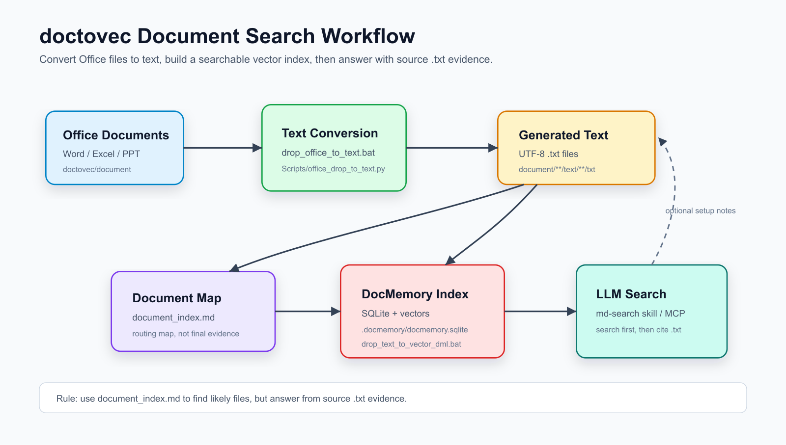

# doctovec



Japanese: [README_ja.md](README_ja.md)

`doctovec` is a local document-search workflow for project documents.

It converts Office files to UTF-8 text, builds a DocMemory vector index, and gives LLMs a clear map for finding source `.txt` evidence.

## Quick Start

1. Put Word/Excel/PowerPoint files under:

```text
document
```

2. For a new PC, run:

```text
install_cli.bat
```

3. Check setup:

```text
installation_status.bat
```

4. Run the full update flow:

```text
0_run_text_vector.bat
```

## What Each File Does

- `0_run_text_vector.bat` converts Office files, syncs vectors, and refreshes `document_index.md`.
- `drop_office_to_text.bat` converts Office files to `.txt`.
- `drop_remove_passwords.bat` removes Office/PDF open-password protection only when local passwords are listed in `Config/pass.txt`.
- `drop_text_to_vector_dml.bat` builds the vector index using DirectML, which can use the PC's iGPU/GPU to speed up embedding. It is not Vulkan.
- `generate_document_index.bat` refreshes the human-readable document map.
- `installation_status.bat` checks tools, folders, skill handoff files, MCP notes, and the DocMemory index.
- `install_cli.bat` asks before setup actions and can download/warm the embedding model without indexing documents.

## Important Rule

Use `document_index.md` as a routing map only.

For factual answers, cite the generated source `.txt` files under `document`.

## Password Privacy

`Config/pass.txt` is committed as a fake/empty placeholder.

Do not put real passwords in Git. Add real passwords only on the local PC when needed. If `Config/pass.txt` has no passwords, password removal is skipped.

## More Detail

See:

```text
Docs\README_tools.md
```
