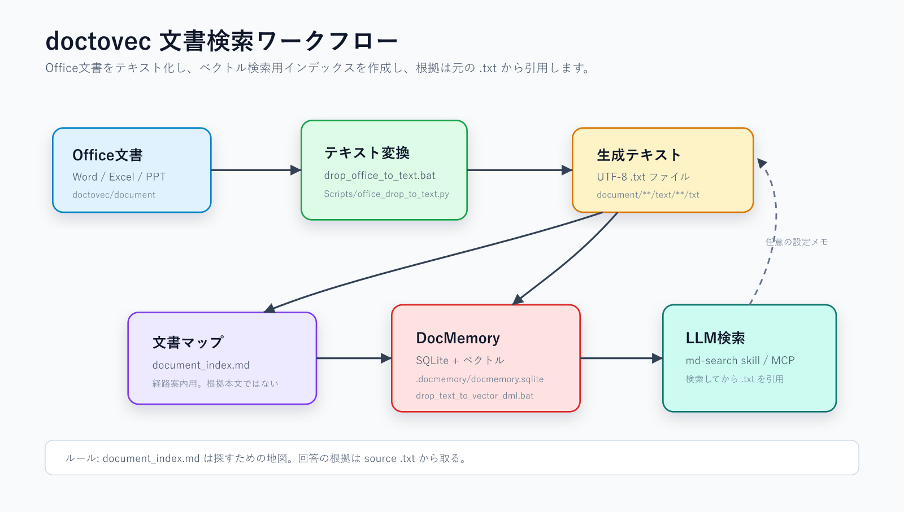

# doctovec



`doctovec` は、プロジェクト文書をローカルで検索するためのワークフローです。

Office文書をUTF-8テキストに変換し、DocMemoryのベクトルインデックスを作り、LLMが根拠となる `.txt` を探しやすくします。

English: [README.md](README.md)

## クイックスタート

1. Word / Excel / PowerPoint ファイルをここに置きます。

```text
document
```

2. 新しいPCでは、最初にこれを実行します。

```text
install_cli.bat
```

3. セットアップ状況を確認します。

```text
installation_status.bat
```

4. 通常の更新フローを実行します。

```text
0_run_text_vector.bat
```

## 主なファイル

- `0_run_text_vector.bat`: Office変換、ベクトル同期、`document_index.md` 更新をまとめて実行します。
- `drop_office_to_text.bat`: Office文書を `.txt` に変換します。
- `drop_remove_passwords.bat`: ローカルPCの `Config/pass.txt` にパスワードがある場合だけ、Office/PDFのオープンパスワードを解除します。
- `drop_text_to_vector_dml.bat`: DirectMLでベクトルインデックスを作成します。PCのiGPU/GPUを使って埋め込み処理を速くできます。Vulkanではありません。
- `generate_document_index.bat`: 人間とLLM用の文書マップを更新します。
- `installation_status.bat`: ツール、フォルダ、skill/MCPメモ、DocMemoryインデックスを確認します。
- `install_cli.bat`: 必要なセットアップ操作を確認しながら進めます。文書のインデックス作成はしません。

## 重要ルール

`document_index.md` は「どの文書を見るべきか」を探すための地図です。

事実確認や回答の根拠には、`document` 配下に生成された元の `.txt` ファイルを引用してください。

## 何をしているか

このフォルダは、Office文書をLLMが探しやすい形に変換するためのものです。

まず、Word / Excel / PowerPoint をそのまま読むのではなく、検索しやすい `.txt` に変換します。Office文書のままだと、LLMや検索ツールが中身を安定して読みにくいからです。

次に、変換した `.txt` をDocMemoryのデータベースに登録します。データベースを作る理由は、毎回すべての文書をLLMに読ませないためです。文書が多いと、全部読むのは遅く、トークンも多く使い、関係ない文書まで混ざりやすくなります。

DocMemoryのデータベースには、文書のテキストと検索用のベクトルが入ります。これにより、質問に近い文書や段落だけを先に探してから、LLMに渡せます。

`document_index.md` は文書の目次・地図です。どの文書がありそうかを探すために使います。ただし、回答の根拠としては使いません。

回答の根拠は、必ず `document` 配下に生成された `.txt` ファイルから取ります。

## パスワードの扱い

`Config/pass.example.txt` は、Git用の安全なテンプレートです。

本物のパスワードはGitに入れないでください。必要なPC上だけで `Config/pass.example.txt` を `Config/pass.txt` にコピーし、そこに本物のパスワードを書きます。

`Config/pass.txt` はGitでは無視されます。

`Config/pass.txt` が無い場合、または有効なパスワードがない場合、パスワード解除処理はスキップされます。

普段の流れはこれです。

```text
1. document にOffice文書を入れる
2. 0_run_text_vector.bat を実行する
3. LLMが document_index.md で候補を探す
4. DocMemoryで関連する .txt を検索する
5. 見つかった .txt を根拠に回答する
```
